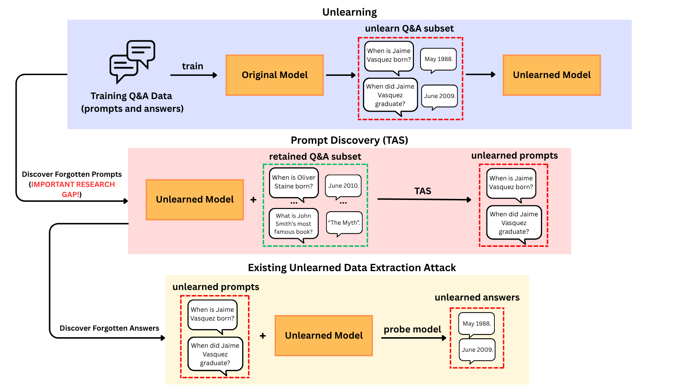

# What was Forgotten? Black-Box Discovery of Hidden Forget Targets in Unlearned LLMs (TAS)



## Welcome!

**TAS** is builts on top of [LUNAR](https://neurips.cc/virtual/2025/loc/san-diego/poster/115574), which performs LLM Unlearning via Neural Activation Redirection. TAS is the first to explore forgotten prompts from black-box unlearned models, which completes the full LLM unlearned data extraction attack.


## 🚀 Quickstart -- Create environment

**Option A — pip**

    python3.10 -m venv .venv
    source .venv/bin/activate
    pip install --upgrade pip
    pip install -r requirements.txt

**Option B — conda (recommended for CUDA)**

    conda create -n lunar python=3.10 -y
    conda activate lunar
    conda env update --file environment.yml --prune

> We recommend **PyTorch ≥ 2.2** with GPU acceleration. For CUDA wheels, follow the official PyTorch guide.


## 📚 Datasets

Place your unlearning datasets under:

    dataset/unlearning/
        pistol_sample1.json
        tofu.json
        dusk.json
        factual_data.json
        ...

Make sure the JSON schema matches what `src/dataset_utils.py` expects.

## ▶️ Run Targeted Active Search (TAS)

The entrypoint is `run_attack.py`, configured by `config/tas.yaml`.
You can override any field from the CLI.

**Example**

    python run_attack.py \
      model_family=llama3-8b-instruct \
      data_name=pistol_sample1

**Key args**
- `model_family`: e.g., `llama3-8b-instruct`, `llama2-7b-chat`, `gemma-7b-it`
- `data_name`: the JSON name under `dataset/unlearning/`

The main code structure is in `TAS`:

```bash
├── TAS/
│   ├── akinator.py
│   ├── analysis.py
│   ├── entity_generator.py
│   ├── generation_learner.py
│   ├── io_utils.py
│   ├── metrics.py
│   ├── model_interface.py
│   ├── name_pool.py
│   ├── perturbations.py
│   ├── postprocess.py
│   ├── rl_explorer.py
│   └── run.py
```

## 🔧 Prerequisite: Fine-tune and unlearning before attack

Unlearning assumes you start from a **task-adapted checkpoint**. In other words, you should **fine-tune your base LLM on the target dataset first**, and then **run the unlearning pipeline** on that fine-tuned model before carrying out the attack.

### 1) Finetuning
We recommend using the PISTOL repo for reproducible fine-tuning and data prep:

- Repo: https://github.com/Ashley0909/TAS-PISTOL
- Output: a fine-tuned model directory (e.g., `.../models_finetune/<dataset>/<model_family>`)

This repository is an extension of https://github.com/bill-shen-BS/PISTOL which we used to finetune models on more extended datasets.

> You can fine-tune any supported base model (e.g., Llama-3, Qwen, Gemma) on your dataset of interest (e.g., TOFU / PISTOL / custom). Change the model family, dataset, and their paths in `config.yaml`, then run

    sbatch run_finetune.sh

### 2) Unlearning

#### DPO and NPO Unlearning
We implemented two baselines in `TAS-PISTOL` for comparison.

Because each baseline and dataset have different configurations, We put all of the configs in the .sh file, so just need to uncomment the desired command to run. However, you still need to change the dataset name on `config.yaml` before running:

    sbatch run_unlearn.sh

Ran files will be in:

- `models_forget/${model_family}_AB/...` for pistol_sample1 dataset;
- `models_forget/${model_family}_DUSK/...` for dusk dataset;

#### LUNAR Unlearning
LUNAR implementation is in this repository, developed by Bill and his team. Update your `config/forget.yaml` including modelfamily, dataset, their paths, and forget edge before running:

    python run_lunar.py num_epochs=5 lr=5e-3 save_unlearned_model=false
or

    sbatch run_unlearn.sh

Resulting files are in:

- `unlearn_results/completion/lunar/${model_family}/model`

## Now, to run TAS 
Make sure to update `config/forget.yaml` to point to the correct model path and model family and run:

    python run_attack.py
or

    sbatch run_tas.sh